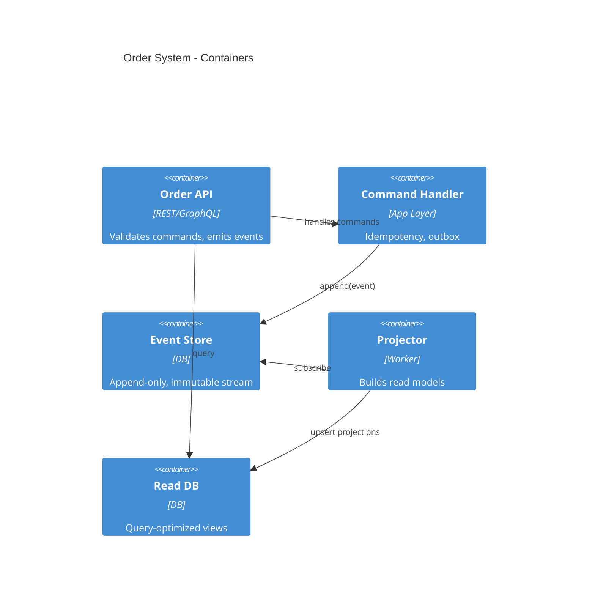

# C4 — Container
Event store: file/JSONL (stub) · Read DB: SQLite

```mermaid
C4Container
title Order System - Containers
Container(order_api, "Order API", "REST/GraphQL", "Validates commands, emits events")
Container(cmd_handler, "Command Handler", "App Layer", "Idempotency, outbox")
Container(event_store, "Event Store", "DB", "Append-only, immutable stream")
Container(projector, "Projector", "Worker", "Builds read models")
Container(read_db, "Read DB", "DB", "Query-optimized views")
Rel(order_api, cmd_handler, "handles commands")
Rel(cmd_handler, event_store, "append(event)")
Rel(projector, event_store, "subscribe")
Rel(projector, read_db, "upsert projections")
Rel(order_api, read_db, "query")
```
