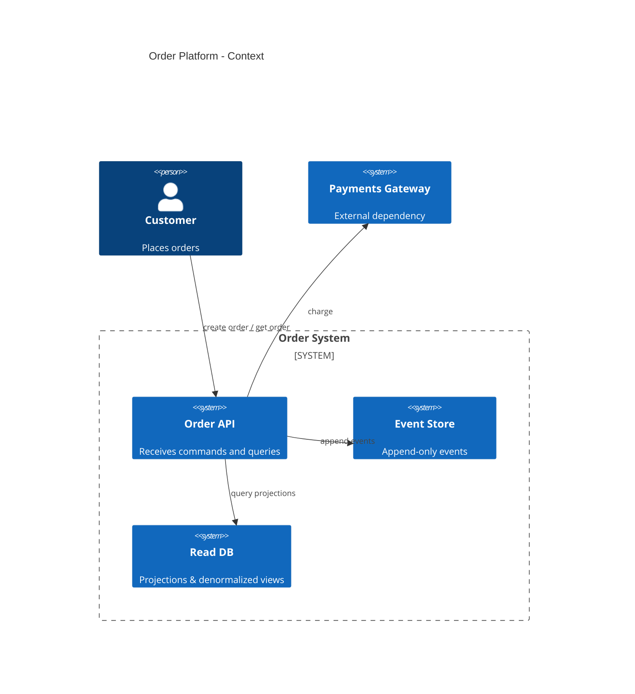

# C4 — Context

```mermaid
C4Context
title Order Platform - Context
Person(customer, "Customer", "Places orders")
System_Boundary(order_sys, "Order System"){
  System(order_api, "Order API", "Receives commands and queries")
  System(event_store, "Event Store", "Append-only events")
  System(read_db, "Read DB", "Projections & denormalized views")
}
System(ext_payments, "Payments Gateway", "External dependency")
Rel(customer, order_api, "create order / get order")
Rel(order_api, event_store, "append events")
Rel(order_api, read_db, "query projections")
Rel(order_api, ext_payments, "charge")
```
