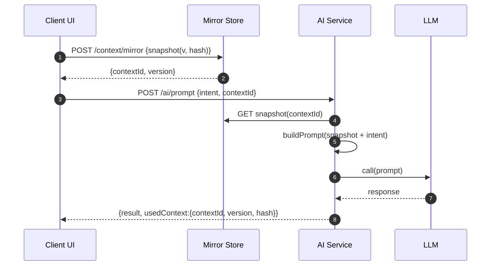

# 🧩 Prompt Context Mirror Pattern

**Purpose:** To maintain a consistent, auditable, and reproducible context between the client and the backend to build complete and reliable AI prompts.

## Problem

In AI-driven applications, the backend often lacks visibility into the client's exact state (e.g., open document, selection, filters), causing inconsistent prompts and poor reproducibility.

## Solution

Create a **context mirror**, a serializable snapshot of the relevant UI state, which the client synchronizes with a persistent store on the backend. The AI service uses this mirror to build the final prompt.

## Forces

  * Network latency and provider failures.
  * Ephemeral UI state vs. persistent server state.
  * The need for auditability, replay, and explainability.
  * **(Enhancement)** **Efficiency vs. Simplicity:** Balancing the network/storage cost of sending full snapshots against the implementation complexity of delta-based synchronization.

## Consequences

* **✅ Reproducibility and traceability:** Every prompt can be reconstructed exactly as it was created.
* **✅ Predictable UX:** The AI responds based on *what the user actually sees*.
* **⚠️ Storage and network cost:** Especially if snapshots are large and sent frequently.
* **⚠️ Implementation complexity:** **(Enhancement)** Delta synchronization, conflict management, and divergence recovery add significant engineering overhead compared to a simple send-everything approach.
* **⚠️ (Enhancement) Potential bottleneck:** The `Mirror Store` can become a central point of failure or a performance bottleneck if not designed to scale horizontally.

## Diagram (Mermaid)



## Components

  * **Client Context Manager**: Observes and serializes relevant UI state.
  * **Mirror Store**: **(Enhancement)** A persistent and versioned cache, organized by `contextId`. Its design must consider scalability (e.g., Redis sharding) to support high concurrency.
  * **Prompt Builder**: Assembles business rules, the context `snapshot`, and the user's `intent`.
  * **AI Service**: Orchestrates context retrieval and calls to the LLM.
  * **Audit Trail**: Long-term storage (e.g., Postgres JSONB, S3) for versioning and replay.

## Snapshot Interface (example)

```ts
export type ContextSnapshot = {
  meta: {
    contextId: string;            // Stable UUID per session/UI
    version: number;              // Incremented on each sync
    hash: string;                 // SHA-256 of the snapshot (detects divergence)
    ts: string;                   // ISO timestamp
    userId: string;
    tenantId?: string;
  };
  user: { plan: 'free'|'pro'; locale: string; };
  doc?: { id: string; title?: string; section?: string };
  selection?: { text?: string; start?: number; end?: number };
  ui?: { route: string; filters?: Record<string, unknown> };
  contextExtra?: Record<string, unknown>;
};

```

## Synchronization Strategies

  * **Debounce and Batching**: Group changes into time windows (e.g., 250–500ms) to prevent excessive traffic.
  * **Delta Synchronization (Delta Sync)**: **(Enhancement)** Instead of sending the full snapshot, the client sends only the fields that have changed.
      * **Implementation:** A standard like **JSON Patch (RFC 6902)** can be used. The client sends a `baseVersion` along with an array of operations (`add`, `replace`, `remove`).
      * **Advantage:** Drastically reduces bandwidth usage if snapshots are large and changes are small.
      * **Disadvantage:** Increases server-side complexity, as the server must retrieve the base version, apply the patch atomically, and validate the result.
  * **Conflict Policy**: For most use cases (a single user modifying their own context), `last-write-wins` is sufficient. Collaborative scenarios would require more advanced strategies like Operational Transformation (OT) or CRDTs.
  * **Divergence Management and Recovery**: The `hash` is key to ensuring integrity.
      * **Detection:** The server can validate the `hash` of the incoming `snapshot` to ensure no corruption occurred in transit. More advanced: the client could send the `hash` of the *previous* version it knows, which the server validates against its stored version to detect if the client is out of sync.
      * **Recovery:** If a hash mismatch is detected, the server should reject the update and respond with an error (e.g., `409 Conflict`). The client must then either request the latest full snapshot from the server or force a full re-sync of its current state.
  * **TTL and Archiving**: Expire inactive snapshots from the hot cache (e.g., after 24h) and move them to cold storage for long-term auditing.

## Integrations
* Complements **LLM Outbox** for resilience.
* Cache in Redis and persist in Postgres (JSONB) for audit trail.

## Prompt Builder Example
```txt
SYSTEM: You are an assistant helping the user with document ${doc.title}.
USER: ${intent}
CONTEXT:\nUser=${userId}, Plan=${plan}, Route=${ui.route}\nSelection=${selection.text}
```

## Suggested Metrics
* `mirror.sync.count`, `mirror.sync.bytes`, `mirror.version.gap` (client vs server).
* `prompt.build.ms`, `prompt.tokens`.
* `replay.success.rate`.

## Security & Privacy
* Data minimization (avoid sending unnecessary PII).
* Client/server redaction (regex/PII detectors) before persistence.
* Encryption in transit (TLS) and at rest (KMS).
* Tenant-level access control and retention policy.

## Use Cases
* ✍️ **Context-aware editors** (text, contract, code editors with AI helpers)
* 🧠 **Knowledge assistants** that reason based on current view or document
* 🧭 **Guided workflows** (AI-driven forms or multi-step assistants)
* 📄 **Document reviewers** (summaries, highlights, translations per selection)
* 🎓 **Learning platforms** (context-based tutoring or feedback)
* 🧱 **LLM QA testing** (replay identical state and intent for deterministic outputs)

## Folder Structure
* [`example/client.tsx`](./example/client.tsx): React + hash sync.
* [`example/server.ts`](./example/server.ts): Fastify + in-memory versioned store.
* [`context.json`](./context.json): example snapshot.