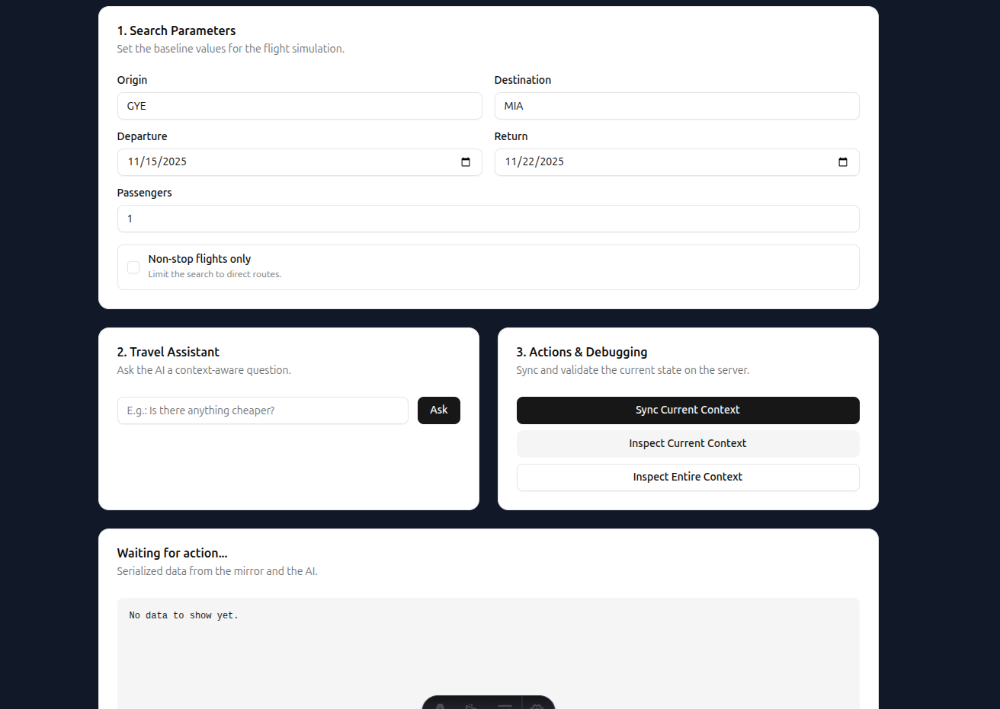

# Prompt Context Mirror Example

This example pairs a small Fastify API with an Astro + React client to demonstrate how the Prompt Context Mirror pattern keeps UI state and backend prompts in sync.



## What You'll See
- A travel search UI that produces context snapshots of the user's selections.
- A mirror service that versions each snapshot and exposes it through REST endpoints.
- A mock LLM endpoint that builds prompts with (or without) the mirrored context so you can inspect the difference.

## Directory Layout
```
example/
├── client/   # Astro app with the TravelAssistant component
├── server/   # Fastify + Zod API that stores and serves snapshots
└── docker-compose.yml
```

## Prerequisites
- Docker and Docker Compose v2

## Run with Docker Compose
```sh
docker compose up --build
```
The compose file installs dependencies, starts the API on port 3001, and serves the client on port 3000.

## How the Flow Works
1. Adjust flight search parameters in the UI and click **Sync Current Context** to POST a snapshot to `/api/context/mirror`.
2. Use **Ask** to send an intent to `/api/ia/prompt`; the server rebuilds a prompt from the latest mirrored state and returns the mock LLM response.
3. Inspect the stored state with **Inspect Current Context** or **Inspect Entire Context** to see the versioned snapshots returned by the API.

## Key Files
- `client/src/components/TravelAssistant.tsx`: Builds the snapshot, syncs it to the server, and renders the inspector UI.
- `server/server.ts`: Validates snapshots with Zod, versions them in memory, and exposes the prompt-building endpoints.
